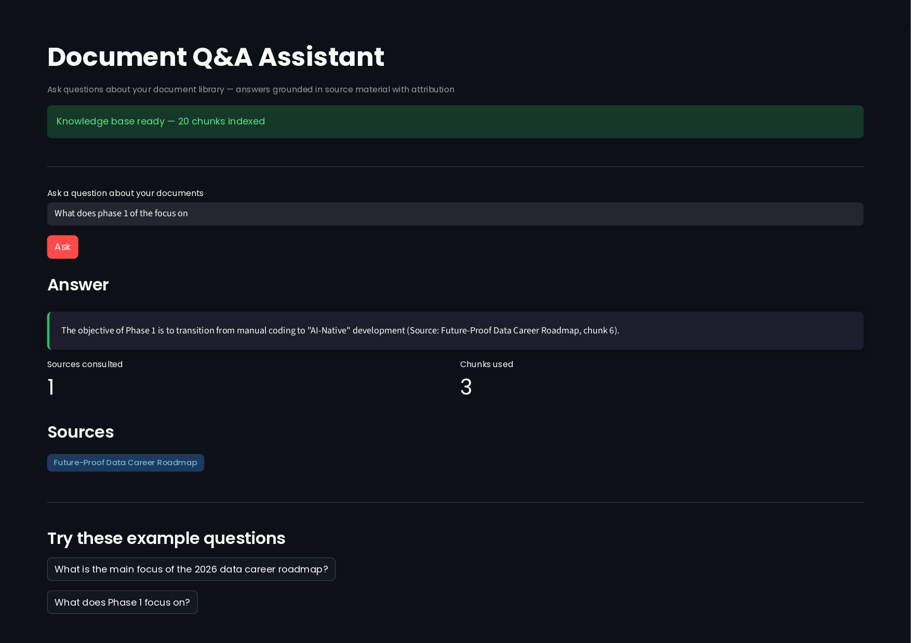

# Document Q&A Assistant

> Natural language question answering across a PDF library — built with confidence thresholds and hybrid retrieval to prevent AI hallucinations.




## Problem

Knowledge workers spend 2.5 hours per day searching for information across documents. Traditional keyword search misses context, searching for "remote work policy" doesn't find the document titled "telecommuting guidelines." Searching for structural terms like "Phase 1" in a long document means scrolling endlessly.

This system lets users ask questions in natural language and returns grounded answers with source attribution, citing the specific document and chunk used to generate each response.

## Features

- **Semantic search** across PDF documents using sentence-transformer embeddings
- **Hybrid retrieval** combining vector similarity with keyword fallback for structural queries
- **Confidence thresholds** that prevent the AI from answering when retrieval quality is low
- **Source attribution** for every answer — document name and chunk index
- **Graceful empty-state handling** when no relevant chunks pass the threshold
- **Streamlit UI** with example queries and source badges

## Architecture
PDF documents
↓ extract text (pypdf)
Text chunks with overlap
↓ embed (all-MiniLM-L6-v2)
Vector store (ChromaDB) + metadata
↓ semantic + keyword retrieval
Confidence-filtered chunks
↓ structured prompt
LLM (Groq Llama-3.1)
↓
Grounded answer with sources

## Tech Stack

- **Python 3.11+**
- **sentence-transformers** — embedding generation
- **ChromaDB** — vector storage and similarity search
- **Groq API** — LLM inference (Llama-3.1-8b-instant)
- **pypdf** — PDF text extraction
- **Streamlit** — web interface

## Setup

```bash
# Clone the repo
git clone the repo
cd document-qna-assistant

# Create environment
conda create -n docqna python=3.11
conda activate docqna

# Install dependencies
pip install -r requirements.txt

# Set your Groq API key (free at console.groq.com)
export GROQ_API_KEY="your-key-here"

# Add PDFs to the documents folder
cp /path/to/your/files/*.pdf documents/

# Run the app
streamlit run app.py
```

## Usage

```python
from ingestor import build_document_collection
from qa_engine import ask

collection = build_document_collection("documents")
result = ask(collection, "What does Phase 1 of the roadmap focus on?")

print(result["answer"])    # Grounded answer
print(result["sources"])   # List of source documents
```

## Key Engineering Decisions

### Chunking Strategy
Documents are split into 300-word chunks with 100-word overlap. The overlap ensures that ideas spanning chunk boundaries remain semantically intact. Chunk size was tuned down from an initial 500 words after observing that smaller chunks improved structural query retrieval.

### Confidence Thresholds
Retrieved chunks with distance scores above 1.2 are filtered out before reaching the LLM. This prevents the AI from generating confident-sounding answers grounded in irrelevant context — the most common RAG failure mode.

### Hybrid Retrieval
Pure semantic search consistently failed on structural queries like "Phase 1" because the embedding model treats those terms as generic. A keyword fallback was added to detect structural language and supplement vector retrieval, dramatically improving recall on document navigation queries.

## Known Limitations

- **Small document libraries** (under 5 documents) may produce poor retrieval results due to limited semantic diversity
- **Tabular data** in PDFs is extracted as plain text, losing structure
- **The token limit** on Groq's free tier (6000 TPM) constrains context size to ~5 chunks at 800 chars each
- **Pure semantic search** alone misses structural queries — the keyword fallback is necessary

## What I Learned Building This

Building this system surfaced three production lessons that most tutorials skip:

1. **Chunking strategy affects retrieval quality more than embedding model choice.** Switching chunk size from 500 to 300 words improved retrieval accuracy more than any model change.

2. **Confidence thresholds are mandatory, not optional.** Without them, the LLM hallucinates plausible-sounding answers from weak retrievals.

3. **Pure semantic search has structural blind spots.** Hybrid retrieval combining keyword and vector approaches is the production standard for a reason.

## License

MIT

## Project Summary
I built a Document Q&A Assistant that ingests a PDF library, chunks documents with overlap to preserve semantic continuity, stores chunks in ChromaDB with source metadata, and answers natural language questions using a RAG pipeline with Groq.
During development I discovered real production failure modes — pure semantic search misses structural queries like 'Phase 1', retrieval quality depends more on chunking strategy than embedding model choice, and token limits force context prioritisation. I implemented a hybrid retrieval approach combining semantic search with keyword fallback to fix the structural query problem, and I learned the importance of verifying retrieval output separately from AI answer quality.
The system includes source attribution for every answer, confidence thresholds to prevent hallucinations, and a Streamlit UI. It's deployed-ready with proper environment variable handling for API keys

## Limitation
Does not support out of scope questions yet